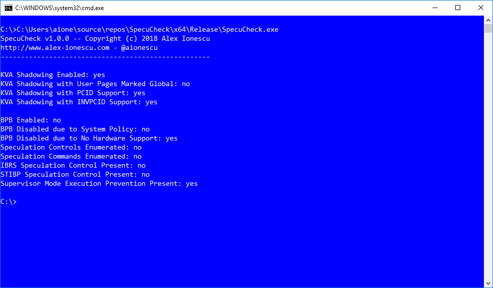

# SpecuCheck

SpecuCheck is a Windows utility for checking the state of the software mitigations against CVE-2017-5754 (Meltdown) and hardware mitigations against CVE-2017-5715 (Spectre). It uses two new information classes that were added to the NtQuerySystemInformation API call as part of the recent patches introduced in January 2018 and reports the data as seen by the Windows Kernel.

## Screenshots



## Introduction

On January 3rd 2018, Intel, AMD and ARM Holdings, as well as a number of OS Vendors reported a series of vulnerabilities that were discovered by Google Project Zero:

* Variant 1: bounds check bypass (CVE-2017-5753)
* Variant 2: branch target injection (CVE-2017-5715)
* Variant 3: rogue data cache load (CVE-2017-5754)

Microsoft released patches for Windows 7 SP1 and higher later that same day. These patches, depending on architecture, OS version, boot settings and a number of hardware-related properties, apply a number of software and hardware mitigations against these issues. The enablement state of these mitigations, their availability, and configuration is stored by the Windows kernel in a number of global variables, and exposed to user-mode callers through an undocumented system call.

SpecuCheck takes advantage of this system call in order to confirm if a system has indeed been patched (non-patched systems will fail the call) and what the status of the mitigations are, which can be used to determine potential performance pitfalls.

## Motivation

There is a lot of noise, hype, and marketing around thie issue, and not a lot of documentation on how to see if you're affected, and at what performance overhead. Microsoft has done great work to expose that data from the kernel-mode in a concise matter, which succintly indicates the kernel's support and usage of the various mitigating technologies and hardware features. SpecuCheck aims to make that data easily accessible by users and IT departments, to avoid having to use a Windows debugger or reverse engineer the API themselves.

## Installation on Windows

SpecuCheck is currently x64 only and has only been tested on Windows 10. Future released versions will support Windows 7 and x86 systems as well. To run SpecuCheck, simply execute it on the command-line:

`c:\SpecuCheck.exe`

Which will result in an informational screen indicating which features/mitigations are enabled.

## References

If you would like to know more about my research or work, I invite you check out my blog at http://www.alex-ionescu.com as well as my training & consulting company, Winsider Seminars & Solutions Inc., at http://www.windows-internals.com.

https://googleprojectzero.blogspot.com/2018/01/reading-privileged-memory-with-side.html

https://portal.msrc.microsoft.com/en-US/security-guidance/advisory/ADV180002

[2]:https://googleprojectzero.blogspot.com/2018/01/reading-privileged-memory-with-side.html
[1]:https://portal.msrc.microsoft.com/en-US/security-guidance/advisory/ADV180002

## Caveats

SpecuCheck relies on undocumented system calls and information classes which are subject to change. Additionally, SpecuCheck only returns the information that the Windows Kernel is storing about the state of the mitigations and hardware features -- based on policy settings (registry, boot parameters) or other compatibility flags, the Windows Kernel's state may not match the true hardware state. The goal of this tool is to give you a Windows-specific assessment, not a hardware assessment that is OS-agnostic.

## License

```
Copyright 2018 Alex Ionescu. All rights reserved. 

Redistribution and use in source and binary forms, with or without modification, are permitted provided
that the following conditions are met: 
1. Redistributions of source code must retain the above copyright notice, this list of conditions and
   the following disclaimer. 
2. Redistributions in binary form must reproduce the above copyright notice, this list of conditions
   and the following disclaimer in the documentation and/or other materials provided with the 
   distribution. 

THIS SOFTWARE IS PROVIDED BY ALEX IONESCU ``AS IS'' AND ANY EXPRESS OR IMPLIED
WARRANTIES, INCLUDING, BUT NOT LIMITED TO, THE IMPLIED WARRANTIES OF MERCHANTABILITY AND
FITNESS FOR A PARTICULAR PURPOSE ARE DISCLAIMED. IN NO EVENT SHALL ALEX IONESCU
OR CONTRIBUTORS BE LIABLE FOR ANY DIRECT, INDIRECT, INCIDENTAL, SPECIAL, EXEMPLARY, OR
CONSEQUENTIAL DAMAGES (INCLUDING, BUT NOT LIMITED TO, PROCUREMENT OF SUBSTITUTE GOODS
OR SERVICES; LOSS OF USE, DATA, OR PROFITS; OR BUSINESS INTERRUPTION) HOWEVER CAUSED
AND ON ANY THEORY OF LIABILITY, WHETHER IN CONTRACT, STRICT LIABILITY, OR TORT (INCLUDING
NEGLIGENCE OR OTHERWISE) ARISING IN ANY WAY OUT OF THE USE OF THIS SOFTWARE, EVEN IF
ADVISED OF THE POSSIBILITY OF SUCH DAMAGE.

The views and conclusions contained in the software and documentation are those of the authors and
should not be interpreted as representing official policies, either expressed or implied, of Alex Ionescu.
```
